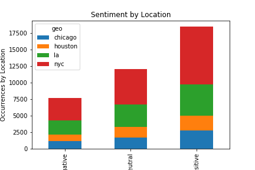

# Project title

**Author**: [Christie Sarver](mailto:christie.sarver@gmail.com)

## Overview


### The Data

The text data used in NLP is sourced from Twitter using the twint package for scraping. This was pulled in from tweets mentioning vaccines within the date range of 1/1/21-6/15/21
The vaccination data was sourced from local government health agency websites. 




### Business Problem


## Methodology 

A variety of pre-processing and modeling techniques were explored in order to effectively transform the text data and build a strong classifier. Model performance was evaluated on accuracy scores to suit the business goal of building an accurate model for future use.  

Preprocessing included:

* Data cleaning and exploration to sort into relevant categories
* Tokenization of words and removal of stop words and grammar. Twitter handles and URLs were also removed
* Vectorization of text data using diffent strategies such as Count Vectorization and TF-IDF

Model types explored were:

* Bayesian Classifiers
* Support Vector Machines
* Neural Nets

## Results

Out of all the iterations of models that I tried, the neural nets using GloVe were most sucessful in achieving high accuracy. However, after trying several different techniques, the overfitting problem still didn't improve too much. The final model iteration used L1 regularization and included drop out layers to reduce sensitivity to variance. 

My final neural net achieved 98% accuracy on the training set but 64% on the test set. I would recommend moving forward with this model to evaluate sentiment around future events and conferences related to tech as it has learned off of a specified data set.


### Conclusions & Future Work


## For More Information

Please reference the [Jupyter Notebook](./Final%20Notebook.ipynb) or review this [presentation](./Sentiment%20Analysis%20with%20Twitter%20NLP.pdf).

## Repository Structure

```
├── Archive
├── Images
├── Data
├── Final Notebook.ipynb
├── Sentiment Analysis with Twitter NLP.pdf
├── README.md

```
Thank you!


## Sources

Vaccination Data
https://github.com/nychealth/covid-vaccine-data/tree/main/doses
http://publichealth.lacounty.gov/media/coronavirus/vaccine/vaccine-dashboard.htm#selectcity
https://data.cityofchicago.org/Health-Human-Services/COVID-19-Daily-Vaccinations-Administered-in-Chicag/4564-ixr2
https://covid-harriscounty.hub.arcgis.com/datasets/1377f9a5a7f94917bb3b552492931af1_0/about

Twitter Data

Other Sources Referenced for Code
