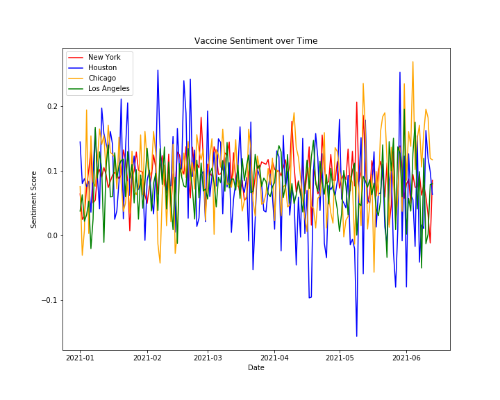
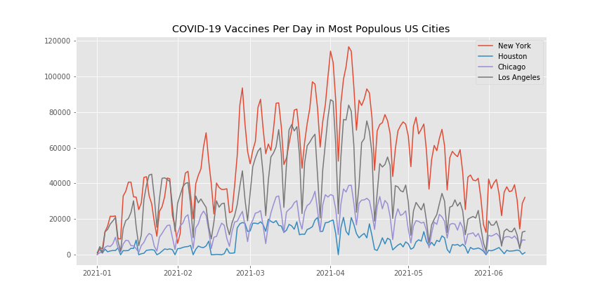
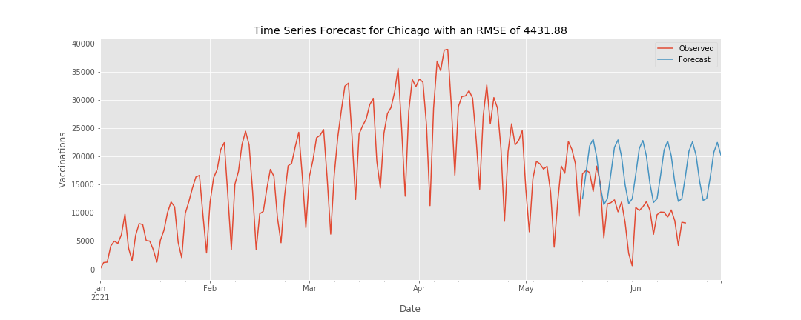

# 2021 Covid-19 Vaccinations & Social Media Sentiment Analysis

**Author**: [Christie Sarver](mailto:christie.sarver@gmail.com)

## Overview
This project explores how sentiment on social media around Covid-19 vaccination relates to trends in how vaccines are administered in the US. It will also  examine current and forecasted trends in terms of vaccinations and social media sentiment in the four most populous US cities: New York, Houston, Los Angeles, and Chicago.  

### The Data

Data for vaccines administered by day comes from each city's health department:

* [NYC Department of Health Github](https://github.com/nychealth/covid-vaccine-data/tree/main/doses)
* [LA County Department of Public Health](http://publichealth.lacounty.gov/media/coronavirus/vaccine/vaccine-dashboard.htm#selectcity)
* [City of Chicago Data Portal](https://data.cityofchicago.org/Health-Human-Services/COVID-19-Daily-Vaccinations-Administered-in-Chicag/4564-ixr2)
* [Harris County / City of Houston COVID-19 Data Hub](https://covid-harriscounty.hub.arcgis.com/datasets/1377f9a5a7f94917bb3b552492931af1_0/about)

Twitter data was scraped using [Twint](https://github.com/twintproject/twint) and matched to a sentiment score using [Textblob](https://textblob.readthedocs.io/en/dev/index.html).

### Business Problem

After an initial success, the US has seen stagnation in vaccination rates while a new contagious Covid variant is spreading. Towards the end of June, government officials announced they likely won't meet President Biden's goal of having 70% of American adults at least partially vaccinated by July 4. Right now, 59% of Americans 18+ are fully vaccinated and 68% have gotten at least one dose. 

Many areas of the country are working to combat vaccine hesitancy and misinformation in a variety of ways. Understanding underlying trends around vaccine communication may help convince more people to get vaccinated, protecting the population against Covid-19 and accelerating an end to the pandemic.
[Source](https://www.nytimes.com/interactive/2020/us/covid-19-vaccine-doses.html?action=click&module=Spotlight&pgtype=Homepage)

## Methodology 

There were multiple components of this project, each separated into a dedicated notebook. Methodologies for each are summarized below with a link to each notebook:

[Twitter Scraping with Twint](./Twitter%20Scraping%20with%20Twint.ipynb)
* Data gathering using Twint as a scraping tool

[Twitter Sentiment Evaluation](./Twitter%20Sentiment%20Evaluation.ipynb)
* Natural language processing of Twint data including text cleaning and processing (Regex, NLTK)
* Tagging tweets with sentiment using Textblob and visualizing by sentiment and by location
* Unsupervised topic modeling and visualization using [Gensim](https://pypi.org/project/gensim/) and [pyLDAvis](https://pyldavis.readthedocs.io/en/latest/readme.html) LDA models



[Vaccinantion Records Analysis](./Vaccinantion%20Records%20Analysis)
* Formatting and cleaning vaccine data with pandas
* Time series modeling using auto ARIMA and ARIMA models
* Correlation analysis between vaccine data and sentiment data



## Results

An overview of results can be found below. Please reference the [presentation](./Vaccination%20Trends%20and%20Social%20Media.pdf) and notebooks for full details. 

__Sentiment Analysis of Twitter Conversation__

* In all topic groupings, there were many common themes, but people were having different experiences with them.
* There were also regional themes that stood out; please see the notebook for topic visualizations

__Time Series Models__
* The patterns of vaccinations are proving difficult to capture for each city to make accurate predictions 
* The New York and Chicago ARIMA models capture periodicity to a certain extent (see NYC forecast below as example)
* Forecasts predict the lowest vaccine amounts per day in Houston at only 5k, with Chicago and LA closer to the same range, and New York continuing to lead



__Correlation__
* The correlation analysis shows that there is a different relationship between social media conversation around vaccines and vaccines administered over time for each city.

* New York shows the highest correlation (see example below), and Chicago shows correlation at a 90 day lag. LA also shows some positive corellation until the end of the timeframe. Houston does not show a clear relationship. 


### Conclusions & Future Work

1. While social media sentiment does show a correlation to vaccinations administered in some areas, it's not strong enough to be conclusive on a generalizable scale. When looking to develop messaging to encourage vaccination, pursue alternate channels and explore how they affect people's actions

2. Time series models helped explained trends in vaccination, but data was not strong enough to forecast accurately. Continue to gather data and monitor patterns; explore extraneous factors that could help inform model.

3. Topic clustering uncovered positive and negative topics of conversation that can help shape pro-vaccination messaging. Use results to build location-specific thought starters, while continuing to expeirment with text processing methods


### Repository Structure

```
├── Archive
├── Files
├── Images
├── Data
├── Twitter Scraping with Twint.ipynb
├── Twitter Sentiment Evaluation.ipynb
├── Vaccinantion Records Analysis.ipynb
├── Vaccination Trends and Social Media.pdf
├── pos_LDAvis_prepared.pickle
├── neg_LDAvis_prepared.pickle
├── README.md

```
Thank you!


