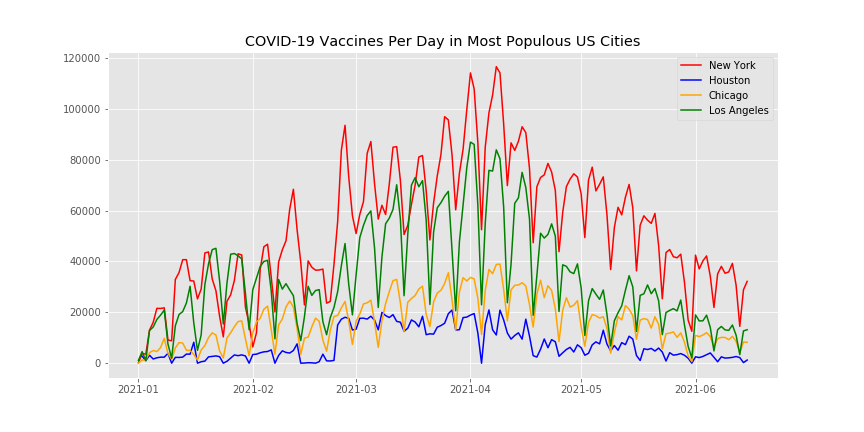

# Project title

**Author**: [Christie Sarver](mailto:christie.sarver@gmail.com)

## Overview
This project explores how sentiment on social media around Covid-19 vaccination relates to trends in how vaccines are administered in the US. It will also  examine current and forecasted trends in terms of vaccinations and social media sentiment in the four most populous US cities: New York, Houston, Los Angeles, and Chicago.  

### The Data

Data for vaccines administered by day comes from each city's health department:

* [NYC Department of Health Github](https://github.com/nychealth/covid-vaccine-data/tree/main/doses)
* [LA County Department of Public Health](http://publichealth.lacounty.gov/media/coronavirus/vaccine/vaccine-dashboard.htm#selectcity)
* [City of Chicago Data Portal](https://data.cityofchicago.org/Health-Human-Services/COVID-19-Daily-Vaccinations-Administered-in-Chicag/4564-ixr2)
* [Harris County / City of Houston COVID-19 Data Hub](https://covid-harriscounty.hub.arcgis.com/datasets/1377f9a5a7f94917bb3b552492931af1_0/about)

Twitter data was scraped using [Twint](https://github.com/twintproject/twint) and matched to a sentiment score using [Textblob](https://textblob.readthedocs.io/en/dev/index.html).

### Business Problem

After an initial success, the US has seen stagnation in vaccination rates while a new contagious Covid variant is spreading. Towards the end of June, government officials announced they likely won't meet President Biden's goal of having 70% of American adults at least partially vaccinated by July 4. Right now, 56% of Americans 18+ are fully vaccinated and 65% have gotten at least one dose. 

Many areas of the country are working to combat vaccine hesitancy and misinformation in a variety of ways. Understanding underlying trends around vaccine communication may help convince more people to get vaccinated, protecting the population against Covid-19 and accelerating an end to the pandemic.


## Methodology 

There were multiple components of this project, each separated into a dedicated notebook. Methodologies for each are summarized below with a link to each notebook:

[Twitter Scraping with Twint](./Twitter%20Scraping%20with%20Twint.ipynb)
* Data gathering using Twint as a scraping tool

[Twitter Sentiment Evaluation](./Twitter%20Sentiment%20Evaluation.ipynb)
* Natural language processing of twint data including text cleaning and processing (Regex, NLTK)
* Tagging tweets with sentiment using Textblob and visualizing by sentiment and by location
* Unsupervised topic modeling and visualization using [Gensim](https://pypi.org/project/gensim/) and [pyLDAvis](https://pyldavis.readthedocs.io/en/latest/readme.html)


[Vaccinantion Records Analysis](./Vaccinantion%20Records%20Analysis)
* Formatting and cleaning vaccine data
* Time series modeling using auto ARIMA and ARIMA models
* Correlation analysis between vaccine data and sentiment data



## Results

Sentiment

Time Series Models

Correlation


### Conclusions & Future Work


## For More Information

Please reference the notebooks for full detail or review this [presentation](./Sentiment%20Analysis%20with%20Twitter%20NLP.pdf).

## Repository Structure

```
├── Archive
├── Images
├── Data
├── Final Notebook.ipynb
├── Sentiment Analysis with Twitter NLP.pdf
├── README.md

```
Thank you!


